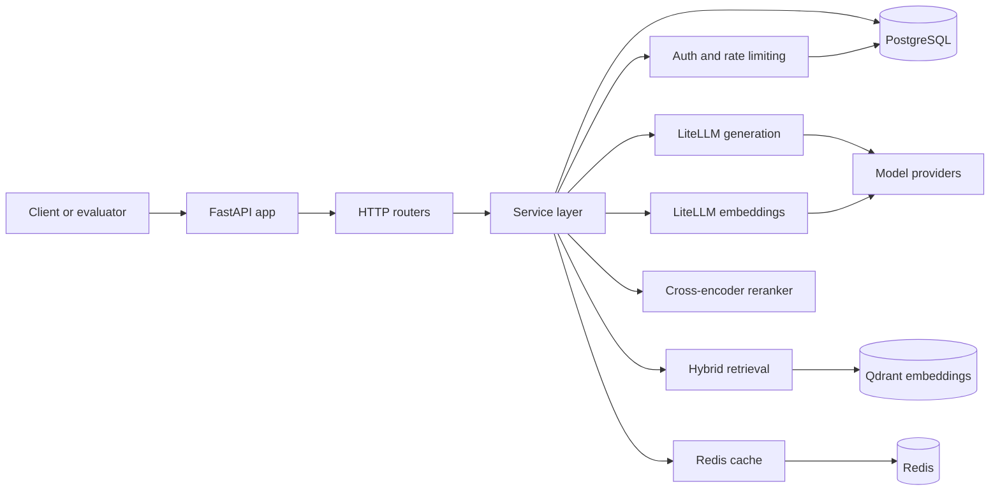
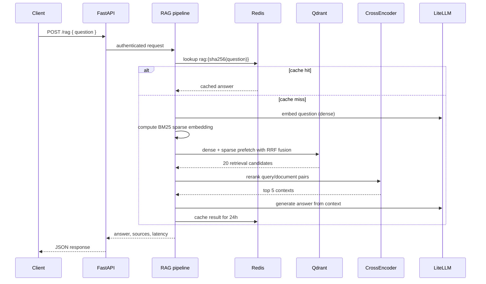
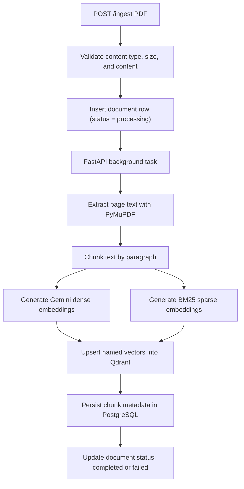

<p align="center">
  <h1 align="center">RAGEval</h1>
  <p align="center">
    <em>Open-source RAG evaluation & serving platform — hybrid retrieval, cross-encoder reranking, LLM-judged evaluation, and production monitoring.</em>
  </p>
  <p align="center">
    <a href="https://www.python.org/"></a>
    <a href="https://fastapi.tiangolo.com/"></a>
    <a href="LICENSE"></a>
    <a href="#quick-start"></a>
  </p>
</p>

---

## What is RAGEval?

RAGEval is an authenticated FastAPI service for **building, operating, and evaluating retrieval-augmented generation (RAG) pipelines**. It provides the backend infrastructure most RAG prototypes eventually need — document ingestion, hybrid retrieval, cross-encoder reranking, answer generation, response caching, API-key auth, rate limiting, and batch LLM-judged evaluation — as a single service you can run locally with Docker Compose.

Think of it as a **self-hosted RAG platform** that bridges the gap between ad-hoc notebook experiments and production evaluation infrastructure.

### Why RAGEval?

| Challenge | RAGEval's approach |
|-----------|-------------------|
| Dense-only retrieval misses keyword matches | **Hybrid dense + sparse** with Qdrant's native RRF fusion |
| Raw vector search order isn't always relevant | **Cross-encoder reranking** of the top 20 candidates |
| Repeated queries are expensive and slow | **Redis cache** with 24-hour TTL and SHA-256 keys |
| No systematic way to measure RAG quality | **LLM-judged batch evaluation** with binary scoring |
| Managing API keys and rate limits is tedious | **Built-in auth** with SHA-256 hashed keys + SlowAPI rate limiting |
| Manual scaling of multiple infrastructure services | **Single `docker compose up`** spins up the full stack |

---

## Quick Start

### Prerequisites

- Python 3.14+ and [`uv`](https://docs.astral.sh/uv/)
- Docker and Docker Compose
- Model provider credentials (set in `.env`)

### 1. Start the stack

```bash
docker compose up --build
```

This starts PostgreSQL, Qdrant, Redis, and the FastAPI app. Migrations run automatically on boot.

### 2. Create an API key

```bash
curl -X POST http://localhost:8000/api-keys \
  -H "Content-Type: application/json" \
  -H "X-Admin-Secret: change-me" \
  -d '{"name":"local-dev"}'
```

Save the returned `api_key` (e.g. `rge_xxx`) — it's shown once and stored as a SHA-256 hash.

### 3. Index content

```bash
curl -X POST http://localhost:8000/embed \
  -H "Content-Type: application/json" \
  -H "X-API-Key: rge_xxx" \
  -d '{"text": "Qdrant stores vectors for similarity search and supports hybrid retrieval with dense and sparse vectors.", "strategy": "paragraph", "source": "docs", "category": "technical"}'
```

### 4. Ask a question

```bash
curl -X POST http://localhost:8000/rag \
  -H "Content-Type: application/json" \
  -H "X-API-Key: rge_xxx" \
  -d '{"question":"What does Qdrant store?"}'
```

```json
{
  "answer": "Qdrant stores vectors for similarity search.",
  "sources": [{"id": "...", "vector_score": 0.83, "rerank_score": 4.1, "text": "..."}],
  "latency_ms": 1240,
  "status": "success"
}
```

### 5. Evaluate quality

```bash
curl -X POST http://localhost:8000/evaluate \
  -H "Content-Type: application/json" \
  -H "X-API-Key: rge_xxx" \
  -d '{"questions": [{"question": "What does Qdrant store?", "expected": "Qdrant stores vectors for similarity search."}]}'
```

Returns accuracy, latency breakdown, costs, and per-question scores.

---

## Features

### 🔍 Hybrid Retrieval (Dense + Sparse)

Dense embeddings (`gemini/gemini-embedding-001`, 1536d) and BM25 sparse vectors (`FastEmbed/Qdrant-bm25`) are fused server-side in Qdrant via Reciprocal Rank Fusion (RRF). This catches both semantic matches and exact keyword matches in a single query.

```python
# Under the hood: Qdrant prefetch + fusion
Prefetch(query=dense_vector, using="dense", limit=80),
Prefetch(query=sparse_vector, using="sparse", limit=80),
# → FusionQuery(fusion=Fusion.RRF)
```

### ⚡ Cross-Encoder Reranking

A `cross-encoder/ms-marco-MiniLM-L-6-v2` re-scores 20 candidates down to the top 5 contexts. The reranker loads lazily on first use and caches as a module singleton.

### 📄 PDF & Text Ingestion

| Method | Input | Processing |
|--------|-------|------------|
| `POST /embed` | Raw text | Synchronous chunk, embed, index |
| `POST /ingest` | PDF (≤25 MB) | Background: extract (PyMuPDF) → paragraph chunk → dense+sparse embed → Qdrant upsert → metadata in PostgreSQL |

### 🛡️ Production Auth & Rate Limiting

- **API keys**: Generated with `secrets.token_urlsafe(32)`, stored as SHA-256 hashes, prefixed `rge_` for identification
- **Admin bootstrap**: Shared `ADMIN_SECRET` env var controls key creation
- **Rate limiting**: 60 requests/hour per key via SlowAPI, violations logged to PostgreSQL

### 🧪 LLM-Judged Evaluation

Batch evaluation runs the full RAG pipeline without cache, then scores each answer against an expected answer using `cerebras/gemma-4-31b`. Results include accuracy, latency, wall-clock time, and cost breakdown.

### 💾 Cache Layer

| Aspect | Detail |
|--------|--------|
| Key scheme | `rag:{sha256(question)}` |
| TTL | 24 hours (configurable) |
| Bypass | `/evaluate` always uses `use_cache=False` |
| Storage | Redis (async client) |

### 🤖 Agent Evaluation Toolkit

The `evals/` directory includes a from-scratch tool-calling agent with PostgreSQL-backed conversation memory, rolling summarization (triggers at 6k tokens), and structured output via `instructor`. Use it to build automated evaluation pipelines.

---

## Architecture



### RAG Request Lifecycle



### PDF Ingestion Lifecycle



---

## API Reference

All protected endpoints require `X-API-Key` header and are rate-limited to 60/hour. Key management requires `X-Admin-Secret`.

| Method | Path | Auth | Description |
|--------|------|------|-------------|
| `GET` | `/` | None | Health check |
| `POST` | `/api-keys` | `X-Admin-Secret` | Create API key (shown once) |
| `POST` | `/complete` | `X-API-Key` | Stream LLM completion |
| `POST` | `/embed` | `X-API-Key` | Chunk, embed, and index text |
| `POST` | `/search` | `X-API-Key` | Hybrid search with optional filters |
| `POST` | `/rag` | `X-API-Key` | Full RAG pipeline (cached) |
| `POST` | `/evaluate` | `X-API-Key` | Batch RAG evaluation (uncached) |
| `POST` | `/ingest` | `X-API-Key` | Upload PDF for background ingestion |
| `GET` | `/documents/{id}` | `X-API-Key` | Poll PDF ingestion status |

### Chunking Strategies

| Strategy | Method | Default params |
|----------|--------|---------------|
| `paragraph` | Split on `\n\s*\n` | — |
| `sentence` | NLTK `sent_tokenize` (punkt_tab) | — |
| `fixed` | `cl100k_base` token windows | 500 tokens, 50 overlap |

### Filtered Search

```bash
curl -X POST http://localhost:8000/search \
  -H "Content-Type: application/json" \
  -H "X-API-Key: rge_xxx" \
  -d '{"query": "vector search", "top_k": 5, "filter": {"category": "technical"}}'
```

### PDF Ingestion

```bash
curl -X POST http://localhost:8000/ingest \
  -H "X-API-Key: rge_xxx" \
  -F "file=@paper.pdf;type=application/pdf"

# Poll status:
curl http://localhost:8000/documents/{document_id} -H "X-API-Key: rge_xxx"
```

---

## Tech Stack

| Layer | Technology | Role |
|-------|-----------|------|
| API | FastAPI + Uvicorn | Async HTTP server |
| Models | LiteLLM | Unified interface to 100+ LLM providers |
| Dense embeddings | `gemini/gemini-embedding-001` | 1536-dim semantic vectors |
| Sparse embeddings | FastEmbed `Qdrant/bm25` | Lexical retrieval |
| Vector store | Qdrant | Named vectors + RRF fusion |
| Reranker | `cross-encoder/ms-marco-MiniLM-L-6-v2` | Relevance scoring |
| Cache | Redis (async) | 24h RAG cache |
| Database | PostgreSQL + SQLAlchemy + asyncpg | Metadata, logs, keys |
| Migrations | Alembic | Schema management |
| Chunking | NLTK + tiktoken | Sentence/paragraph/fixed |
| Judge model | `cerebras/gemma-4-31b` | Answer evaluation |
| Agent framework | instructor + LiteLLM | Structured agent output |
| Load testing | Locust | Traffic simulation |
| Package mgmt | uv | Fast dependency management |

---

## Configuration

Create a `.env` file:

```env
# Required
QDRANT_URL=http://localhost:6333
ADMIN_SECRET=change-me

# Optional (shown with defaults)
DATABASE_URL=postgresql+asyncpg://user:password@db:5432/rageval_logs
REDIS_URL=redis://localhost:6379/0
PRELOAD_RERANKER=false
PORT=8000

# Provider keys (at least one needed)
GEMINI_API_KEY=your_gemini_key
GROQ_API_KEY=your_groq_key
```

| Variable | Default | Description |
|----------|---------|-------------|
| `DATABASE_URL` | `postgresql+asyncpg://user:password@db:5432/rageval_logs` | Async PostgreSQL connection |
| `QDRANT_URL` | — | Qdrant endpoint |
| `QDRANT_API_KEY` | (none) | For Qdrant Cloud |
| `REDIS_URL` | `redis://localhost:6379/0` | Redis connection |
| `ADMIN_SECRET` | — | Shared secret for key creation |
| `PRELOAD_RERANKER` | `false` | Preload CrossEncoder at startup |
| `PORT` | `8000` | Container port |
| `LOCUST_API_KEY` | `""` | Key for load testing |

---

## Project Structure

```
src/
├── main.py               # FastAPI app, lifespan, route registration
├── chunking/
│   └── strategies.py      # Fixed/sentence/paragraph chunking
├── clients/
│   ├── qdrant.py          # AsyncQdrantClient singleton
│   └── redis_client.py    # Redis async client
├── db/
│   ├── models.py          # SQLAlchemy ORM (7 tables)
│   └── session.py         # Async engine + session factory
├── routers/
│   ├── api_keys.py        # POST /api-keys
│   ├── completions.py     # POST /complete (streaming)
│   ├── documents.py       # GET /documents/{id}
│   ├── embed.py           # POST /embed
│   ├── evaluate.py        # POST /evaluate (batched, concurrent)
│   ├── ingest.py          # POST /ingest (PDF, background)
│   ├── rag.py             # POST /rag
│   └── search.py          # POST /search
└── services/
    ├── auth.py            # Key generation, hashing, verification
    ├── auth_dependency.py # FastAPI Depends for auth headers
    ├── cache.py           # Redis cache (SHA-256 keys, 24h TTL)
    ├── embeddings.py      # Dense (LiteLLM) + sparse (FastEmbed)
    ├── generation.py      # Context-grounded + streaming generation
    ├── ingestion.py       # PDF extraction, chunking, indexing
    ├── judge.py           # LLM answer evaluation
    ├── rag_pipeline.py    # Embed → search → rerank → generate → cache
    ├── rate_limiter.py    # SlowAPI + PostgreSQL logging
    ├── reranking.py       # CrossEncoder singleton
    └── retrieval.py       # Hybrid search with Qdrant RRF

alembic/                   # Database migrations (5 revisions)
tests/                     # Pytest suite (chunking, cache, reranker)
evals/                     # Agent loop, memory, seed corpus, load testing
```

---

## Development

```bash
# Install with optional ML extras (required for reranker)
uv sync --extra ml

# Start backing services
docker compose up db qdrant redis

# Run migrations
uv run alembic upgrade head

# Start dev server with hot reload
uv run uvicorn src.main:app --reload
```

### Tests

```bash
# Full suite
uv run pytest

# Focused runs
uv run pytest tests/test_chunking.py
uv run pytest tests/test_reranker.py
uv run pytest tests/test_rag_cache.py
```

Tests use `fakeredis` for cache tests and `unittest.mock` for external calls (LiteLLM, Qdrant). No external services needed.

### Formatting & CI

```bash
uvx black --check src/ tests/
```

GitHub Actions runs lint + tests on push/PR to `main`. See [`.github/workflows/ci.yml`](.github/workflows/ci.yml).

### Evaluation Scripts

```bash
# Compare vector search vs reranked order (requires running API)
uv run python evals/eval_reranking.py --base-url http://localhost:8000

# Seed the vector store with sample documents
uv run python evals/seed_corpus.py --base-url http://localhost:8000

# Locust load test
LOCUST_API_KEY=rge_xxx uv run locust -f evals/locustfile.py

# Rate limit test (61st request must be 429)
uv run python evals/test_rate_limit.py --base-url http://localhost:8000 --api-key rge_xxx

# 20-turn conversation memory test (agent recall)
uv run python -m evals.test_conversation_memory --base-url http://localhost:8000 --api-key rge_xxx
```

---

## Design Decisions

- **Hybrid search over dense-only**: Dense vectors capture semantics; BM25 sparse vectors preserve exact terms, names, and technical phrases that embeddings can blur.
- **RRF inside Qdrant**: Dense and sparse prefetches fuse server-side, keeping retrieval logic compact and network round-trips minimal.
- **20 candidates → rerank → top 5**: Wide retrieval gives the cross-encoder enough material to reorder effectively before the final LLM context.
- **Lazy reranker loading**: The CrossEncoder loads on first use by default. Set `PRELOAD_RERANKER=true` when predictable first-request latency matters.
- **Hash-only API key storage**: Keys are generated once, stored as SHA-256 hashes, with the first 12 characters as a human-readable prefix.
- **Operational data in PostgreSQL**: Vector payloads live in Qdrant; PostgreSQL stores audit logs, ingestion state, chunk metadata, and rate-limit records.

---

## Roadmap

- [ ] Expose conversation-memory APIs (tables exist, no endpoints yet)
- [ ] Configurable retrieval count, rerank depth, model names, and cache TTL
- [ ] API key revocation and listing
- [ ] Structured cost tracking (RAG cost is currently a placeholder)
- [ ] Live-stack integration tests for Qdrant, PostgreSQL, Redis failure modes
- [ ] First-class agent evaluation metrics

---

## Contributing

1. Fork the repository
2. Create a focused feature branch
3. Install dependencies: `uv sync --extra ml`
4. Run tests: `uv run pytest`
5. Format: `uvx black src/ tests/`
6. Open a pull request

Keep API changes aligned with the Pydantic models in `src/routers/`. Avoid documenting benchmark numbers from unreproducible runs.

---


